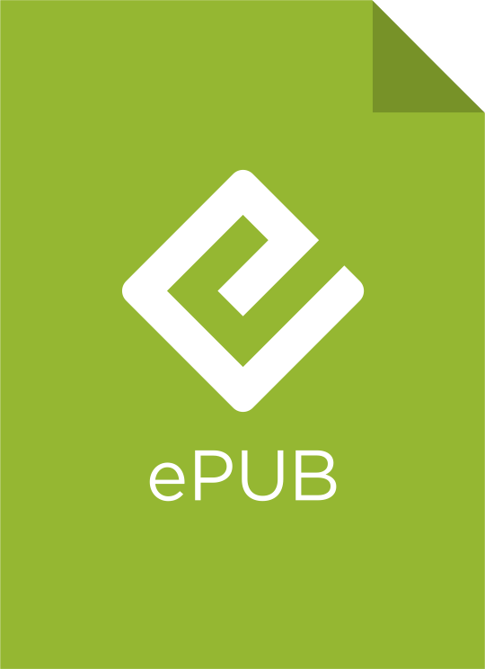

# Welcome to Vipassana for Hackers!

"Vipassana for Hackers" is intended to provide a secular, scientifically-minded audience with practical meditation literature as it concerns Vipassana meditation. This literature is organized into papers, published as printable PDF and e-reader-friendly EPUB. The first of these papers is complete and ready to download below. As further papers are written, I will publish them here.

If you would like to see the original LaTeX source (particularly if you would like to fix a bug in rendering), it is available at the GitHub link at the top of this page. Enjoy!

<section>

</section>

(PDF and EPUB icons by [Alex Miles](https://dribbble.com/shots/1250286-PDF-ePub-vector-logos).)
